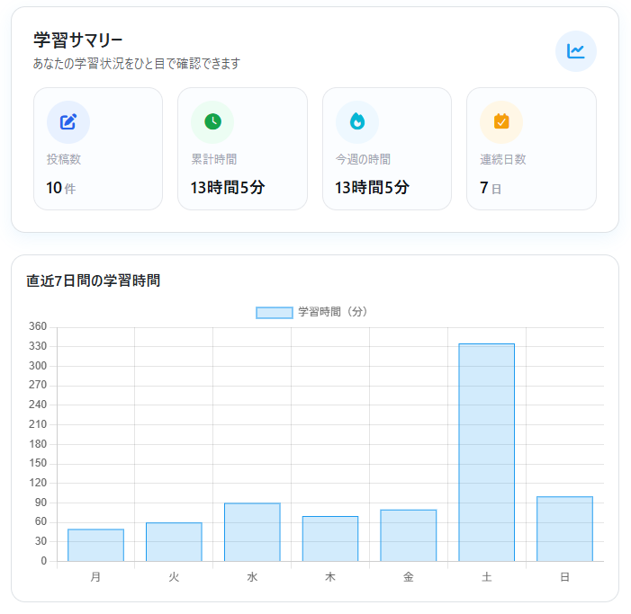
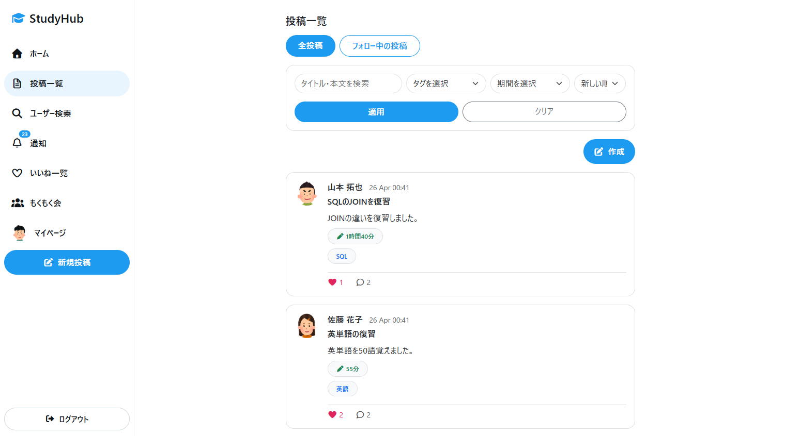
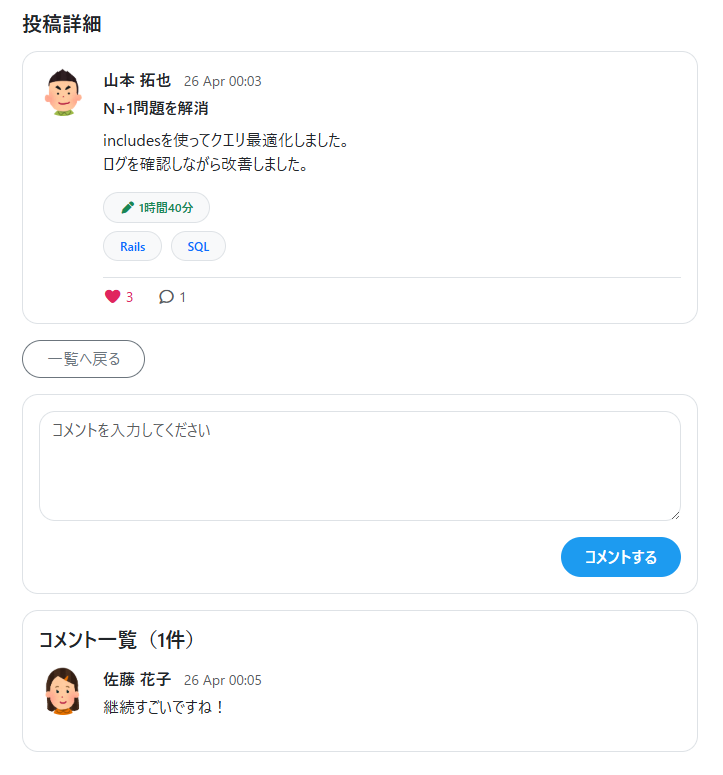
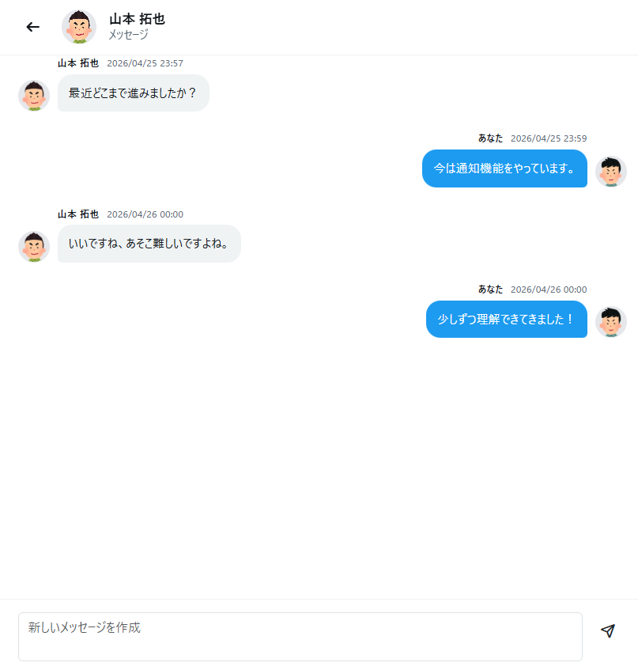
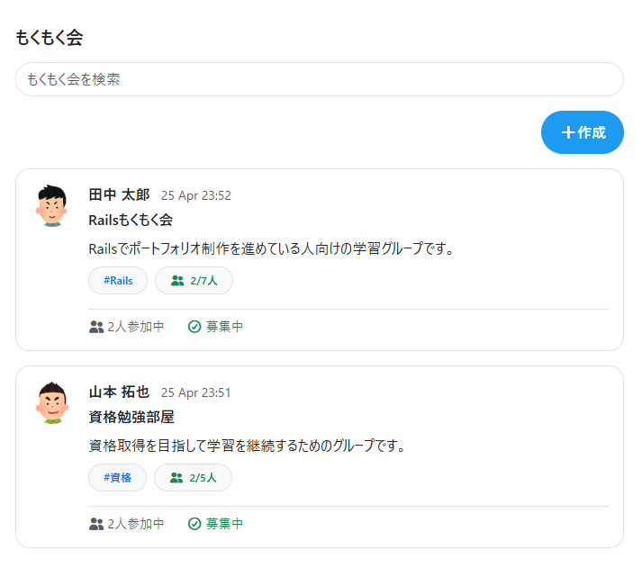
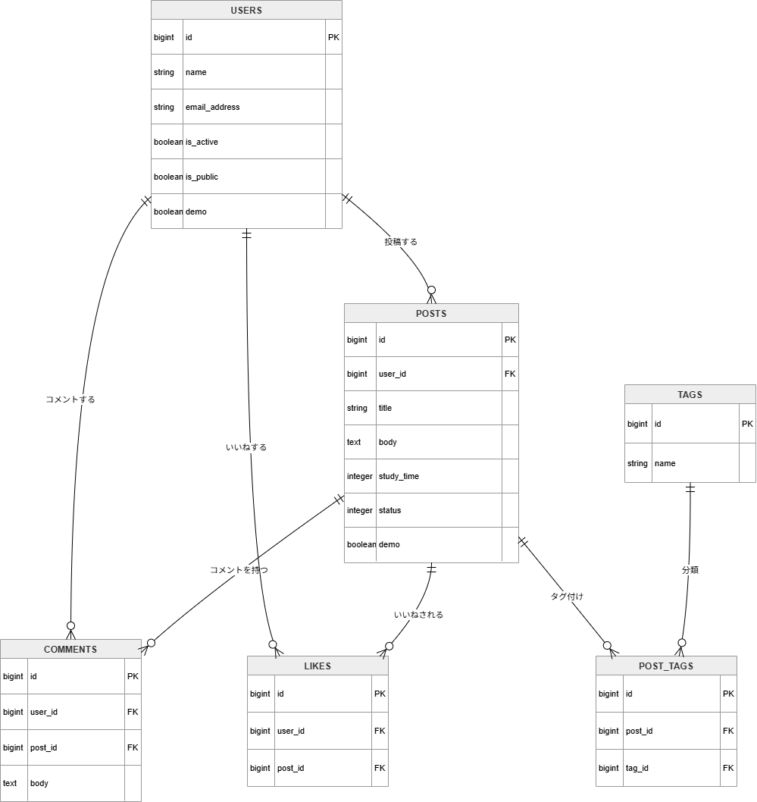
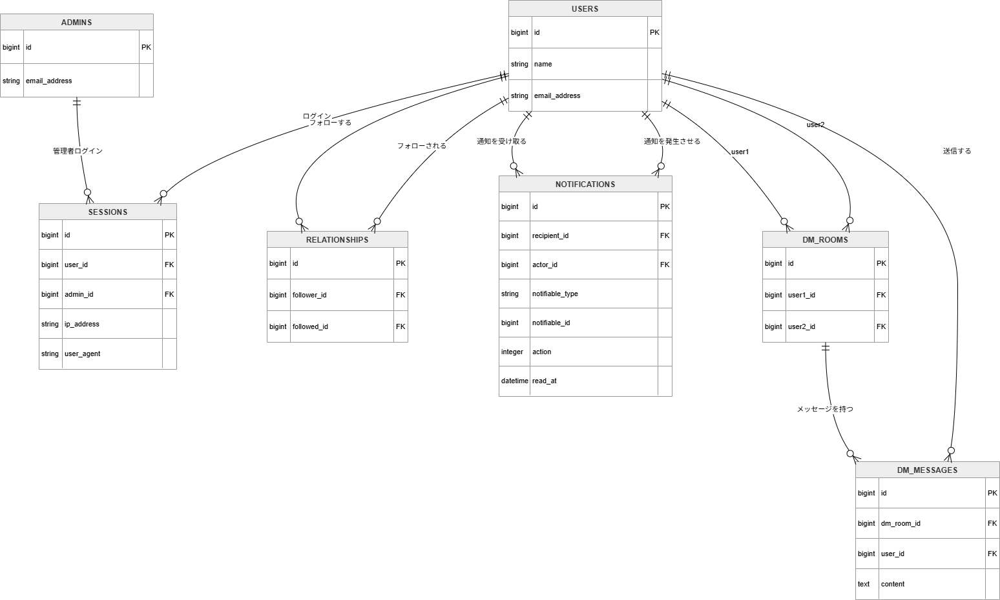
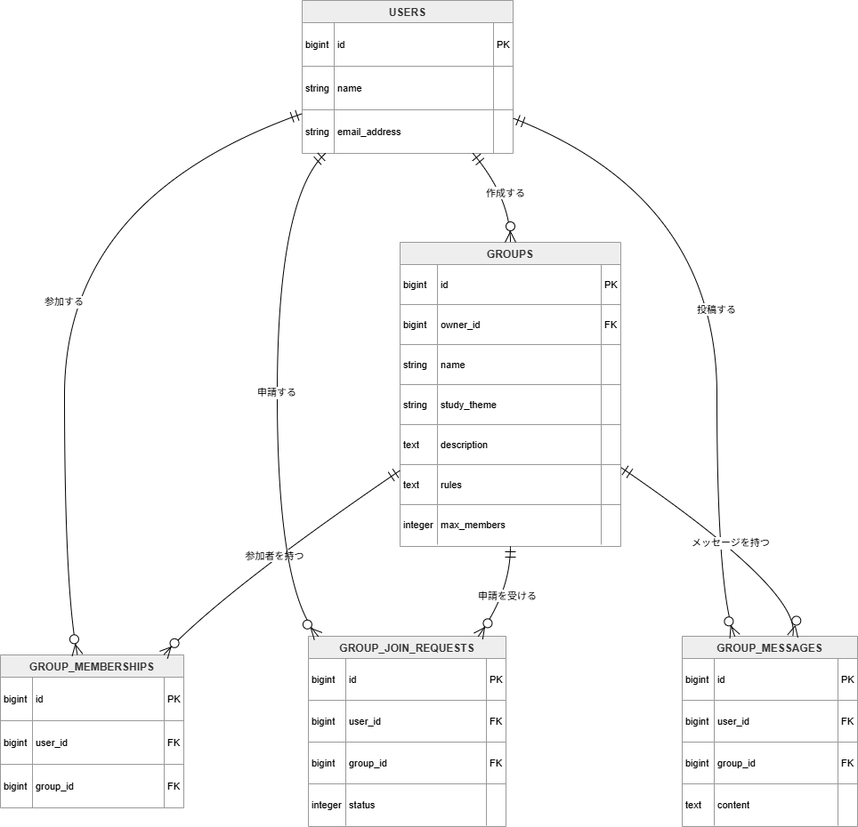

# StudyHub

## サイト概要

### サイトテーマ
学習の継続と習慣化を目的とした、学習者向けコミュニティ型SNSです。

### テーマを選んだ理由
私はこれまで学習を進める中で、モチベーションの維持や継続が難しいと感じることが多くありました。特に一人で学習していると、自分の進捗が見えづらく、途中で挫折してしまうことが課題だと感じていました。

また、一般的なSNSでは学習に特化した情報共有や継続支援の仕組みが十分ではなく、学習者同士が互いに刺激し合いながら成長できる環境が不足していると考えました。

そこで、学習の記録を可視化し、ユーザー同士が交流しながら継続を支援できる環境を提供することで、「継続できない」「成果が見えない」「仲間がいない」といった課題を解決できるのではないかと考え、本ポートフォリオを制作いたしました。

### ターゲットユーザ
- 学習の継続が難しく、モチベーションを維持したい人
- 日々の学習記録を可視化し、成長を実感したい人
- 同じ目標を持つ学習者とつながり、刺激を受けながら学びたい人
- プログラミングや資格勉強などを習慣化したい人

### 主な利用シーン
- 学習内容や学習時間を記録したい時
- 日々の学習の進捗や成果を振り返りたい時
- 他の学習者の取り組みを見てモチベーションを高めたい時
- 学習仲間と交流しながら学習を継続したい時

---

## 📸 アプリケーション画面

### 🧠 学習サマリー
学習時間・投稿数・継続日数を可視化し、学習の習慣化を支援します。

---

### 📝 投稿一覧
学習内容・学習時間・タグを投稿し、他のユーザーの学習状況を確認できます。

---

### 💬 投稿詳細・コメント
投稿に対してコメントやいいねを行い、ユーザー同士で交流できます。

---

### 📩 DM機能
相互フォローしているユーザー同士で、個別にメッセージのやり取りが可能です。

---

### 👥 もくもく会（グループ機能）
同じ目標を持つユーザー同士で学習グループを作成し、継続的な学習を支援します。

---

## URL
- アプリURL：http://13.113.151.78
- GitHubリポジトリ：https://github.com/jigangdade60/studyhub

---

## テスト用アカウント

### 一般ユーザー
- メールアドレス：demo@studyhub.com
- パスワード：password

### 管理者
- 管理者用URL : http://13.113.151.78/admin/login
- メールアドレス：admin@example.com
- パスワード：password

---

## 機能一覧

### ユーザー側
- 新規登録・ログイン・ログアウト機能
- 投稿機能
- 投稿編集・削除機能
- 下書き・公開設定機能
- 投稿検索機能
- タグ検索機能
- いいね機能
- コメント機能
- フォロー・フォロワー機能
- タイムライン機能
- 通知機能
- DM機能
- グループ作成・参加申請機能
- 学習時間の可視化機能
- プロフィール画像設定機能

### 管理者側
- 管理者ログイン・ログアウト機能
- ユーザー管理機能
- コメント管理機能
- グループ管理機能

---

## ER図

### 投稿・学習機能

### SNS機能

### グループ機能

---

## 開発環境
- OS：Windows / Ubuntu
- 言語：HTML / CSS / JavaScript / Ruby / SQL
- フレームワーク：Ruby on Rails
- データベース：MySQL
- Webサーバー：Nginx
- アプリケーションサーバー：Puma
- インフラ：AWS EC2 / RDS
- IDE：Visual Studio Code

---

## 使用技術
- Ruby
- Ruby on Rails
- MySQL
- Bootstrap
- JavaScript
- Active Storage
- Nginx
- Puma
- AWS EC2
- AWS RDS

---

## 使用素材
著作権を考慮し、アプリ内で使用しているデータは架空のデータを使用しています。  
画像素材を使用する場合は、利用規約を確認し、使用可能な素材のみを使用します。